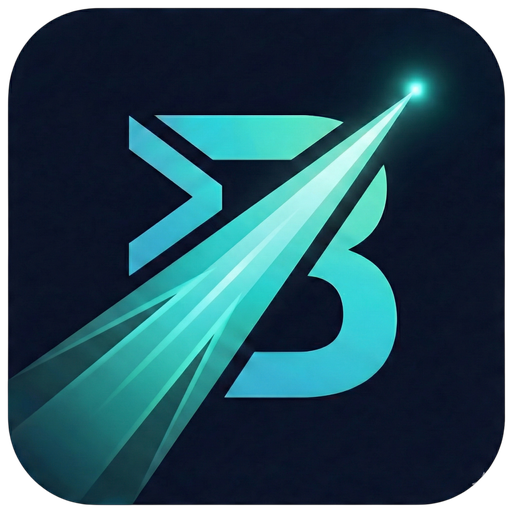

<div align="center">



# Beam

**A blazing-fast, open-source command launcher for Linux**

_Raycast-inspired. Native speed. Endlessly extensible._

<br/>

[](https://github.com/krishkalaria12/beam)
[](https://tauri.app/)
[](https://react.dev/)
[](https://bun.sh/)
[](http://makeapullrequest.com)
[](./LICENSE)

<br/>

> Press `Super + Space`. Type anything. Get things done.

<br/>

</div>

---

## What is Beam?

Beam is a keyboard-first command launcher desktop app built on **Tauri v2 + React 19**. It lives silently in the background as a transparent, borderless overlay window — always a single hotkey away.

It combines a command palette, productivity tools, integrations, and a Raycast-compatible extension runtime into one unified interface. No Electron overhead. No macOS lock-in. Native Linux performance.

---

## Features

### Command Palette

The core of Beam is a registry-first command system with smart ranking, fuzzy matching, and trigger modes.

- **Fuzzy search** across all commands, apps, files, and custom entries
- **Smart ranking** — frequency, recency, pinned boosts, alias & keyword matching
- **Trigger prefixes** — route to sub-modes instantly:
  - `!` → Quicklinks
  - `$` → System actions
  - `>` → Script commands
  - (all symbols are user-configurable)
- **Pinned commands** — pin any command to the top of results
- **Recent commands** — surfaces your most-used commands automatically
- **Per-command hotkeys** — bind any command to a keyboard shortcut

---

### Built-in Panels

| Panel                  | Description                                                                                                  |
| ---------------------- | ------------------------------------------------------------------------------------------------------------ |
| **Application Search** | Discovers and launches installed apps via freedesktop `.desktop` files with icon resolution                  |
| **Calculator**         | Natural language math via SoulverCore (Linux port) with expression history                                   |
| **Clipboard History**  | Persistent clipboard monitor — stores up to 100 entries (text + images), AES-GCM encrypted, fuzzy searchable |
| **File Search**        | Real-time indexed search powered by nucleo fuzzy matching and a background file watcher                      |
| **Todo**               | Full todo list with sub-todos, ordering, and CRUD — stored in SQLite                                         |
| **Snippets**           | Text expansion with delimiter/instant triggers, Markdown + Code support                                      |
| **Quicklinks**         | User-defined URL shortcuts with keyword triggers and favicon previews                                        |
| **Emoji Picker**       | Full emoji library with 10 categories via `emojibase-data`                                                   |
| **Dictionary**         | Word definitions from the Free Dictionary API                                                                |
| **Translation**        | Auto-detecting text translation via Google Translate (unofficial API)                                        |
| **Speed Test**         | Network speed test powered by `@cloudflare/speedtest`                                                        |
| **Window Switcher**    | Lists and focuses open windows via Hyprland IPC or SwayIPC                                                   |
| **Script Commands**    | Discover and run local scripts with Raycast-compatible argument metadata                                     |
| **System Actions**     | Shutdown, reboot, sleep, hibernate, and keep-awake controls                                                  |
| **Calculator History** | Browse and re-use past calculator results (up to 50 entries)                                                 |

---

### AI Chat

A full-featured AI assistant panel with first-class multi-provider support.

- **Providers**: OpenRouter, OpenAI, Anthropic, Gemini
- **Streaming responses** with live markdown rendering
- **File attachments** — up to 8 files, 25 MB each (base64 encoded)
- **Conversation history** with automatic context compaction
- **Token usage tracking** per conversation
- **API keys stored securely** in the system keyring
- All conversations persisted in `chat.sqlite3`

---

### Integrations

#### Spotify

- Full OAuth2 PKCE authentication flow
- Playback controls: play, pause, next, previous
- Search tracks, artists, and albums
- Multi-device management
- Token stored securely in system keyring

#### GitHub

- OAuth2 PKCE authentication flow
- View assigned issues
- Search pull requests and issues
- Token stored securely in system keyring

---

### Extensions

Beam ships a **Raycast-compatible extension runtime** — a compiled Node.js sidecar process that runs extensions using a custom React reconciler.

- **Extension Store** — browse, install, and uninstall extensions
- **React-based extension UIs** rendered inside the launcher
- **Preferences system** per extension
- **OAuth forwarding** — extensions can initiate OAuth flows via `beam://oauth`
- **Browser Extension Bridge** — Chrome/Firefox extensions push tab data to Beam via a local HTTP server at `127.0.0.1:38957`

---

### Voice Dictation

Push-to-talk voice dictation via the `hyprwhspr` CLI (Linux only).

- Start, stop, cancel, and toggle recording
- Status feedback within the launcher

---

### UI & Theming

- **Three visual styles**: Default, Glassy (blur + transparency), Solid
- **Two layout modes**: Expanded (full list) and Compressed (input-only when idle)
- **Custom launcher themes** from filesystem (`theme.json` + `theme.css`)
- **System theme support** — follows light/dark OS preference
- Transparent, borderless, always-on-top overlay window (800 × 580 px)

### Custom Launcher Themes

Beam discovers external themes from:

- `<app-config-dir>/themes/<theme-id>/theme.json`
- `<app-config-dir>/themes/<theme-id>/theme.css`

Use **Settings → Visual Style → Custom Themes** to select one.

Starter examples:

- `examples/themes/base`
- `examples/themes/neo-brutalism`

Theme authoring contract:

- `docs/theme-contract.md`

---

## Architecture

```
beam/
├── src/                    React launcher UI, command registry, feature modules
│   ├── command-registry/   Static commands, dynamic providers, dispatcher, ranker
│   └── modules/            One directory per feature panel
├── src-tauri/              Rust backend — IPC commands, persistence, system APIs
│   └── src/                ~80 Tauri IPC commands across all feature modules
├── sidecar/                Node.js extension runtime (React reconciler + RPC)
├── packages/protocol/      Shared Zod-validated message schemas (frontend ↔ sidecar)
└── browser-extension/      Chrome + Firefox bridge extensions
```

**Frontend → Backend communication** happens entirely over Tauri's typed IPC. The sidecar extension runtime communicates with the main process over stdin/stdout using JSON + msgpack.

---

## Tech Stack

### Frontend

|                  |                                 |
| ---------------- | ------------------------------- |
| UI Framework     | React 19.2                      |
| Routing          | TanStack Router v1 (file-based) |
| Data Fetching    | TanStack Query v5               |
| Forms            | TanStack Form                   |
| State Management | Zustand v5                      |
| Styling          | Tailwind CSS v4                 |
| Animation        | Framer Motion                   |
| Command Palette  | cmdk                            |
| Drag & Drop      | @dnd-kit                        |
| Charts           | Recharts                        |
| AI SDK           | Vercel AI SDK v6                |
| Toasts           | Sonner                          |
| Icons            | @phosphor-icons, lucide-react   |
| Validation       | Zod v4                          |
| Markdown         | streamdown (streaming)          |

### Backend (Rust)

|                   |                                |
| ----------------- | ------------------------------ |
| Desktop Framework | Tauri v2.10                    |
| Async Runtime     | tokio                          |
| Database          | SQLx 0.8 + SQLite              |
| Fuzzy Search      | nucleo                         |
| Concurrent Map    | papaya                         |
| Clipboard         | arboard (Wayland support)      |
| Keyring           | keyring                        |
| Encryption        | aes-gcm                        |
| HTTP Client       | reqwest + rustls               |
| File Watching     | notify + notify-debouncer-mini |
| File Walking      | walkdir + ignore               |
| Wayland Portal    | ashpd                          |
| Window Management | hyprland + swayipc             |
| AI Backend        | rig-core                       |
| Serialization     | serde, rkyv, msgpackr          |

### Tooling

- **Package Manager / Runtime**: Bun
- **Build Tool**: Vite 6 + @vitejs/plugin-react-swc
- **React Compiler**: babel-plugin-react-compiler
- **Linting**: oxlint
- **Formatting**: oxfmt (JS/TS), cargo fmt (Rust)
- **Sidecar Bundling**: esbuild + @yao-pkg/pkg + patchelf

---

## Getting Started

### Prerequisites

- [Bun](https://bun.sh/) (latest stable)
- [Rust toolchain](https://rustup.rs/) (`rustup`, Cargo)
- Tauri system dependencies — see [Tauri prerequisites](https://tauri.app/start/prerequisites/)
- `patchelf` (recommended on Linux, used during build)

> **Note**: Beam is Linux-first. It uses freedesktop app discovery, Wayland compositor hotkey APIs, and Linux-specific Soulver library artifacts. Cross-platform support is planned but not yet complete.

### Install dependencies

```bash
bun install
```

### Development

```bash
bun run desktop:dev
```

Starts Vite (on `http://localhost:3001`) and Tauri together in development mode.

### Build

```bash
bun run desktop:build
```

### All available commands

```bash
bun run dev               # Vite frontend only
bun run desktop:dev       # Tauri + Vite (full app)
bun run build             # Frontend build only
bun run desktop:build     # Full desktop app build
bun run check-types       # TypeScript type check
bun run sidecar:check     # Sidecar TypeScript check
bun run sidecar:build     # Rebuild sidecar binary
bun run fmt:check         # JS/TS format check
bun run rust:fmt:check    # Rust format check
```

---

## Configuration

### Global Hotkey

Default: `Super + Space`. Configurable from `Settings → Hotkeys`.

On Wayland, Beam uses the XDG Desktop Portal for global shortcut registration. If your compositor does not support the portal, you can bind the hotkey manually and launch Beam with the `--toggle` flag.

### Trigger Symbols

Change the prefix symbols for quicklinks (`!`), system actions (`$`), and script commands (`>`) from `Settings → Trigger Symbols`.

### UI Style

Three options available from `Settings → Style`:

- **Default** — follows system appearance
- **Glassy** — frosted glass with background blur
- **Solid** — fully opaque surfaces

---

## Integrations Setup

### Spotify & GitHub OAuth

1. Create an OAuth application on [Spotify Developer Dashboard](https://developer.spotify.com/dashboard) or [GitHub Developer Settings](https://github.com/settings/developers).
2. Set the redirect URI to:
   ```
   beam://oauth
   ```
3. Open the Spotify or GitHub panel in Beam and enter your Client ID.
4. Complete the browser authentication flow.

Tokens are stored securely in the system keyring.

---

## Browser Extension Bridge

Beam runs a local HTTP bridge at `http://127.0.0.1:38957` for browser extension APIs.

| Endpoint         | Method | Description            |
| ---------------- | ------ | ---------------------- |
| `/bridge/health` | `GET`  | Health check           |
| `/bridge/tabs`   | `POST` | Sync open browser tabs |

- Chrome extension: `browser-extension/chrome/`
- Firefox extension: `browser-extension/firefox/`
- Full setup instructions: [`browser-extension/README.md`](./browser-extension/README.md)

---

## Script Commands

Place scripts in Beam's script-commands directory. Beam auto-discovers them and supports Raycast-compatible argument metadata:

```bash
#!/bin/bash

# @raycast.argument1 {"type":"text","placeholder":"Name","required":true}
# @raycast.argument2 {"type":"dropdown","placeholder":"Environment","required":false,"data":[{"title":"Dev","value":"dev"},{"title":"Prod","value":"prod"}]}

echo "Hello, $1 in $2!"
```

Supported argument types: `text`, `password`, `dropdown`. Scripts time out after 60 seconds.

---

## Contributing

1. Fork the repository and create a feature branch.
2. Keep changes aligned with the existing command registry and extension runtime patterns.
3. Run all checks before opening a PR:

```bash
bun run check-types
bun run fmt:check
bun run rust:fmt:check
```

4. Your PR description should cover: what changed, why it changed, compatibility impact, and how you tested it.

### Current focus areas

- Broader test coverage across frontend and backend modules
- Cross-platform parity beyond Linux-first integrations
- Extension API and runtime compatibility improvements
- Hotkey and compositor fallback hardening

---

## Persistence

Beam stores data across multiple backends depending on sensitivity:

| Data                                                | Storage                                           |
| --------------------------------------------------- | ------------------------------------------------- |
| Settings, quicklinks, clipboard, calculator history | `tauri-plugin-store` (JSON files in app data dir) |
| AI conversations                                    | `chat.sqlite3`                                    |
| Todos & sub-todos                                   | `todo.sqlite3`                                    |
| Snippets                                            | `snippets.sqlite3`                                |
| Clipboard entries                                   | AES-GCM encrypted JSON                            |
| AI API keys, OAuth tokens                           | System keyring                                    |
| Extension OAuth tokens                              | `oauth_tokens.json`                               |
| UI preferences, trigger symbols                     | `localStorage`                                    |

---

## References

- [Tauri documentation](https://tauri.app/)
- [TanStack Router documentation](https://tanstack.com/router/latest)
- [Raycast Extension API reference](https://developers.raycast.com/api-reference/)

---

## Star History

[](https://star-history.com/#krishkalaria12/beam&Date)

---

<div align="center">

Built with Tauri + React + Rust &nbsp;·&nbsp; Linux-first, open-source

</div>
