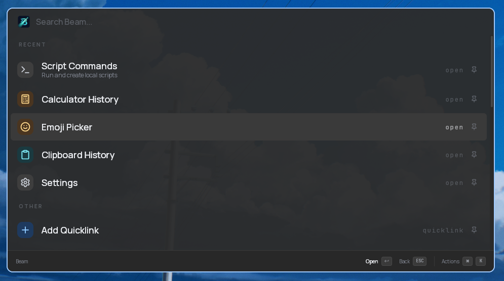

<div align="center">

# Beam

**An open-source command launcher for Linux.**



</div>

## About

Beam is a keyboard-first command launcher built with **Tauri v2** and **React**. It brings a Raycast-like experience to Linux — fast, extensible, and always a hotkey away.

## Features

- **Command Palette** — Fuzzy search across apps, files, commands, and custom entries
- **Clipboard Manager** — Encrypted, searchable clipboard history
- **Calculator** — Natural language math, conversions, and live rates
- **File Search** — Real-time indexed file search
- **AI Chat** — Multi-provider support (OpenAI, Anthropic, Gemini, OpenRouter)
- **Extensions** — Raycast-compatible extension runtime with a built-in store
- **Focus Mode** — Timed app and website blocking for deep work sessions
- **Snippets** — Text expansion with configurable triggers
- **Custom Themes** — Full CSS theming support with light/dark mode sync

## Quick Start

```bash
git clone https://github.com/krishkalaria12/beam.git
cd beam
bun install
bun run desktop:dev
```

### Prerequisites

- [Bun](https://bun.sh/)
- [Rust](https://rustup.rs/)
- [Tauri v2 Dependencies](https://tauri.app/start/prerequisites/)

## Focus Mode Browser Extension

Focus Mode blocks desktop apps natively, but website blocking requires the Beam browser extension to be installed and connected to the local Beam bridge.

- **Firefox / Zen Browser:** load `packages/browser-extension/firefox/manifest.json` from `about:debugging#/runtime/this-firefox`
- **Chrome / Chromium:** load `packages/browser-extension/chrome` from `chrome://extensions` with Developer Mode enabled

Keep Beam running while using website blocking. The Focus Mode footer shows whether the browser bridge is connected.

## Contributing

1. Fork the repo
2. Create a feature branch
3. Run checks before submitting:
   ```bash
   bun run lint && bun run check-types && bun run fmt:check
   ```
4. Open a pull request

## License

[MIT](./LICENSE)
