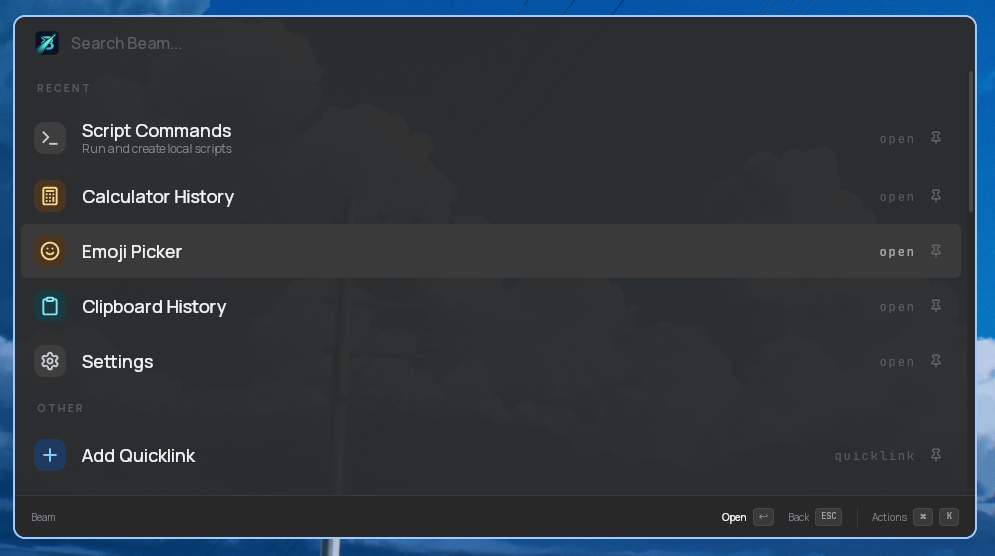

<div align="center">

# Beam

**An open-source command launcher for Linux and Windows.**



</div>

## About

Beam is a keyboard-first command launcher built with **Tauri v2** and **React**. It brings a Raycast-like experience to Linux and Windows — fast, extensible, and always a hotkey away.

## Features

- **Command Palette** — Fuzzy search across apps, files, commands, and custom entries
- **Clipboard Manager** — Encrypted, searchable clipboard history
- **Calculator** — Natural language math, conversions, and live rates
- **File Search** — Real-time indexed file search
- **AI Chat** — Multi-provider support (OpenAI, Anthropic, Gemini, OpenRouter)
- **Extensions** — Raycast-compatible extension runtime with a built-in store
- **Focus Mode** — Timed app and website blocking for deep work sessions
- **Snippets** — Text expansion with configurable triggers
- **Custom Themes** — Full CSS theming support with light/dark mode sync

## Install

### Arch Linux

Install Beam from the AUR package:

- [beam-launcher-bin](https://aur.archlinux.org/packages/beam-launcher-bin)

```bash
yay -S beam-launcher-bin
```

### Other Linux Distributions

Download the latest Linux release from GitHub:

- [Beam releases](https://github.com/krishkalaria12/beam/releases)

Install the latest `.deb` build with `curl`:

```bash
curl -s https://api.github.com/repos/krishkalaria12/beam/releases/latest \
  | grep browser_download_url \
  | grep '\.deb"' \
  | cut -d '"' -f 4 \
  | xargs curl -L -o beam.deb

sudo apt install ./beam.deb
```

### Windows

Download the latest Windows installer from GitHub:

- [Beam releases](https://github.com/krishkalaria12/beam/releases)

Grab the `.exe` (NSIS) or `.msi` installer and run it. Both register the `beam://` deep-link scheme automatically.

Install the latest `.exe` build with `curl` (PowerShell):

```powershell
curl.exe -s https://api.github.com/repos/krishkalaria12/beam/releases/latest `
  | Select-String -Pattern '.*?(https://[^"]+\.exe)"' `
  | ForEach-Object { $_.Matches[0].Groups[1].Value } `
  | ForEach-Object { curl.exe -L -o beam-setup.exe $_ }
```

Install the latest `.rpm` build with `curl`:

```bash
curl -s https://api.github.com/repos/krishkalaria12/beam/releases/latest \
  | grep browser_download_url \
  | grep '\.rpm"' \
  | cut -d '"' -f 4 \
  | xargs curl -L -o beam.rpm

sudo rpm -i beam.rpm
```

## Keybinding

Beam can be opened from your desktop environment or launched from a terminal:

```bash
beam
```

To toggle the launcher from your window manager, bind a shortcut to:

```bash
beam --toggle
```

Examples:

```ini
# Hyprland: ~/.config/hypr/hyprland.conf
bind = SUPER, Space, exec, beam --toggle

# Sway/i3: ~/.config/sway/config or ~/.config/i3/config
bindsym Mod4+space exec beam --toggle
```

```kdl
// niri: ~/.config/niri/config.kdl
binds {
    Mod+Space { spawn "beam" "--toggle"; }
}
```

## Development Setup

```bash
git clone https://github.com/krishkalaria12/beam.git
cd beam
cargo run --package beam
```

### Prerequisites

- [Rust](https://rustup.rs/) (1.95+, pinned via `rust-toolchain.toml`)
- Linux: wayland/x11 client libs, xkbcommon, fontconfig (`sudo apt install libwayland-dev libxkbcommon-dev libxkbcommon-x11-dev libfontconfig1-dev libfreetype6-dev libudev-dev libgtk-3-dev protobuf-compiler`)
- macOS: Xcode Command Line Tools
- Windows: MSVC build tools, protobuf

The extension-manager bundle (for extension support) is built with bun:

```bash
bun install
bun run extension-manager:build
```

## Focus Mode Browser Extension

Focus Mode blocks desktop apps natively, but website blocking requires the Beam browser extension to be installed and connected to the local Beam bridge.

- **Firefox / Zen Browser:** load `packages/browser-extension/firefox/manifest.json` from `about:debugging#/runtime/this-firefox`
- **Chrome / Chromium:** load `packages/browser-extension/chrome` from `chrome://extensions` with Developer Mode enabled

Keep Beam running while using website blocking. The Focus Mode footer shows whether the browser bridge is connected.

## Contributing

1. Fork the repo
2. Create a feature branch
3. Run checks before submitting:
   ```bash
   bun run lint && bun run check-types && bun run fmt:check
   ```
4. Open a pull request

## License

[MIT](./LICENSE)
